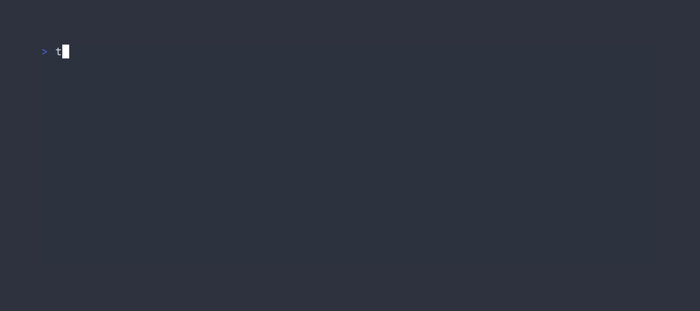

# Cometary

An alternative to [Comet](https://github.com/liamg/comet) with additional features.



The way I've changed the original is for it to look and feel more like [Commitizen](https://github.com/commitizen-tools/commitizen) when invoking its sub-command `commit`. My only gripe was that the start-up speed was a tad on the slow side sometimes, given that it is Python, and that customizing the prompts wasn't as straight-forward as with Comet.

What I missed with Comet though was that Commitizen's `commit` by default keeps the values given for previous prompts on the screen, as seen in the [demo](https://github.com/commitizen-tools/commitizen/raw/master/docs/images/demo.gif), and that in and of itself was a major sticking point in continuing to use Comet.

Other minor changes include a fix to the prompt that asks for a commit message body that was misaligned and a check prior to running that confirms whether there are even any files that can be committed (i.e. are in the staging area). More improvements have been made in terms of customizing the character input limits for the scope, message, or setting a total one in general and having a visible character count for all limit types.

## Installation

- using `go install`:

```bash
go install github.com/usrme/cometary@latest
```

- download a binary from the [releases](https://github.com/usrme/cometary/releases) page

- build it yourself (requires Go 1.17+):

```bash
git clone https://github.com/usrme/cometary.git
cd cometary
go build
```

## Removal

```bash
rm -f "${GOPATH}/bin/cometary"
rm -rf "${GOPATH}/pkg/mod/github.com/usrme/cometary*"
```

## Usage

There is an additional `comet.json` file that includes the prefixes and descriptions that I most prefer myself, which can be added to either the root of a repository, to one's home directory as `.comet.json` or to `${XDG_CONFIG_HOME}/cometary/config.json`. Omitting this means that the same defaults are used as in the original.

- To adjust the character limit of the scope, add the key `scopeInputCharLimit` into the `.comet.json` file with the desired limit
  - Omitting the key uses a default value of 16 characters
- To adjust the character limit of the message, add the key `commitInputCharLimit` into the `.comet.json` file with the desired limit
  - Omitting the key uses a default value of 100 characters
- To adjust the total limit of characters in the *resulting* commit message, add the key `totalInputCharLimit` into the `.comet.json` file with the desired limit
  - Adding this key overrides scope- and message-specific limits
- To adjust the order of the scope completion values (i.e. longer or shorter strings first), then add the key `scopeOrderCompletion` into the `.comet.json` file with either `ascending` or `descending` as the values
  - Omitting the key uses a default order of descending

## Acknowledgments

Couldn't have been possible without the work of [Liam Galvin](https://github.com/liamg).

## License

[MIT](/LICENSE)
